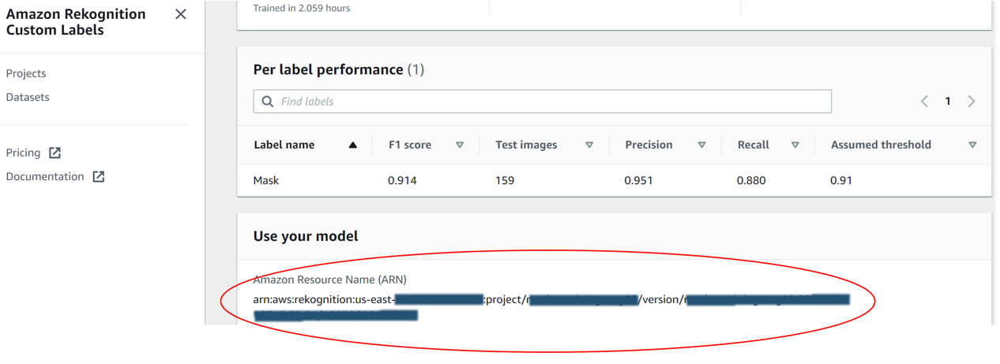
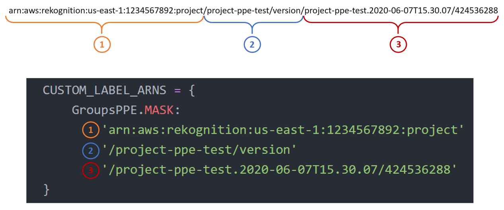

## Rekognition’s Pre-Trained Model
We started by using the script provided in the AWS Worker Safety project, which focuses on detecting helmets only. After further development, we were able to adapt the code so that the model could detect multiple PPEs at the same time.
While performing the preliminary tests, it was noted that facemasks were not part of the Rekognition’s object catalog, and safety vests were rarely detected. It was assumed that the model had limited predictive power compared to results for safety helmets and boots. 
* Reference URL: https://github.com/aws-samples/aws-deeplens-worker-safety-project

## Rekognition’s Custom Labels Model
Unlike Rekognition’s pre-trained models, a custom label model requires a manual start and stop of the service via a command-line interface (CLI) before the execution of the Lambda function. 

### Lambda_PreTrained_and_CustomLabels.py --> Initial Configuration

1. Make sure you have trained a model via Rekognition's Custom Labels: https://docs.aws.amazon.com/rekognition/latest/customlabels-dg/cp-create-project.html
2. Each Custom Labels project is assigned with an [ARN](https://docs.aws.amazon.com/general/latest/gr/aws-arns-and-namespaces.html). This resource contains the name of the project, the region and its current version.

3. Once you have installed and configured Amazon's CLI in your machine, go to your terminal and use these commands to start and stop the service

      **Start: 

        aws rekognition start-project-version \ 

          --project-version-arn "<Enter full service ARN>" \ 

          --min-inference-units 1 \ 

          --region <Enter our region> 
        
      **Stop: 

          aws rekognition stop-project-version \ 

            --project-version-arn "<Enter full service ARN>" \ 

            --region <Enter our region> 

Once the service was in RUNNING phase (takes approximately 5-10 minutes), you will be able to use the Lambda function the same way with Rekognition’s pretrained model.

**Note:** this service charges by the hour - approximately US$4. Make sure you stop the resource once you finish. 

4. In the Lambda_PreTrained_and_CustomLabels.py file, go to line 53 and adjust according to below image. Please note that this sample has a mock ARN (do not use). 

5. Adjust the extra options from line 39 to 61 by adding or excluding label names (depending on your use case)
6. Run your pipeline the same way you did with the pretrained model
